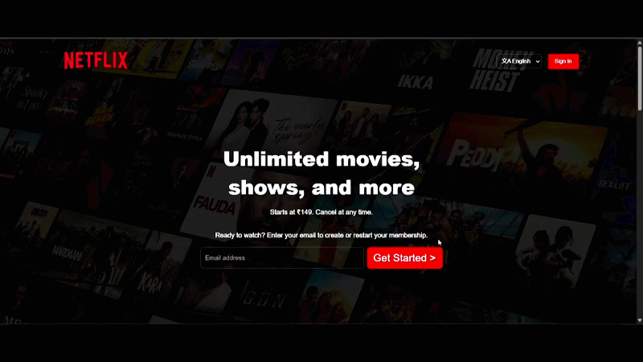

# Netflix India UI Clone

A front-end clone of the Netflix India landing page, built with plain HTML and CSS to practice layout, responsive design, and UI replication.

## 🚀 Demo


Open `index.html` in your browser to view the page locally.

## ✨ Features

- Hero section with background image, overlay, and email sign-up CTA
- Trending Now horizontal scroll section with ranked cards
- "More Reasons to Join" feature grid
- Accordion-style FAQ section (built with native `<details>`/`<summary>`)
- Call-to-action bar with email input
- Multi-column footer with language selector
- Fully responsive layout with a dedicated mobile breakpoint

## 🛠️ Built With

- **HTML5**
- **CSS3** (Flexbox, Grid, custom properties via Google Fonts import)

## 📁 Project Structure


## ▶️ Getting Started

1. Clone the repo:
```bash
   git clone https://github.com/<your-username>/<repo-name>.git
```
2. Navigate into the project folder:
```bash
   cd <repo-name>
```
3. Open `index.html` in your browser (or use a Live Server extension in your editor).

## 📌 Notes

This project is a **static UI clone** built for learning/practice purposes only. It is not affiliated with, endorsed by, or connected to Netflix, Inc. in any way, and is not intended for commercial use.

## 📄 License

This project is licensed under the MIT License — see the [LICENSE](LICENSE) file for details.
